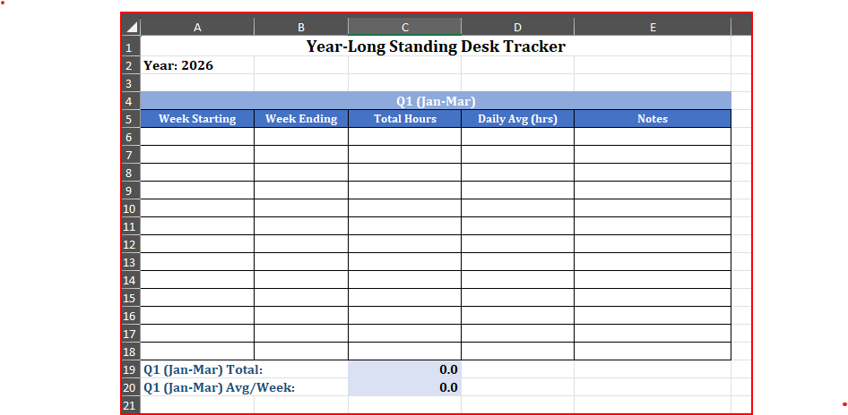
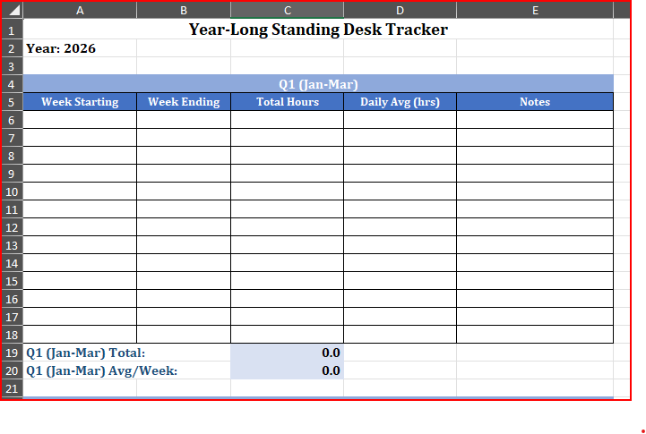
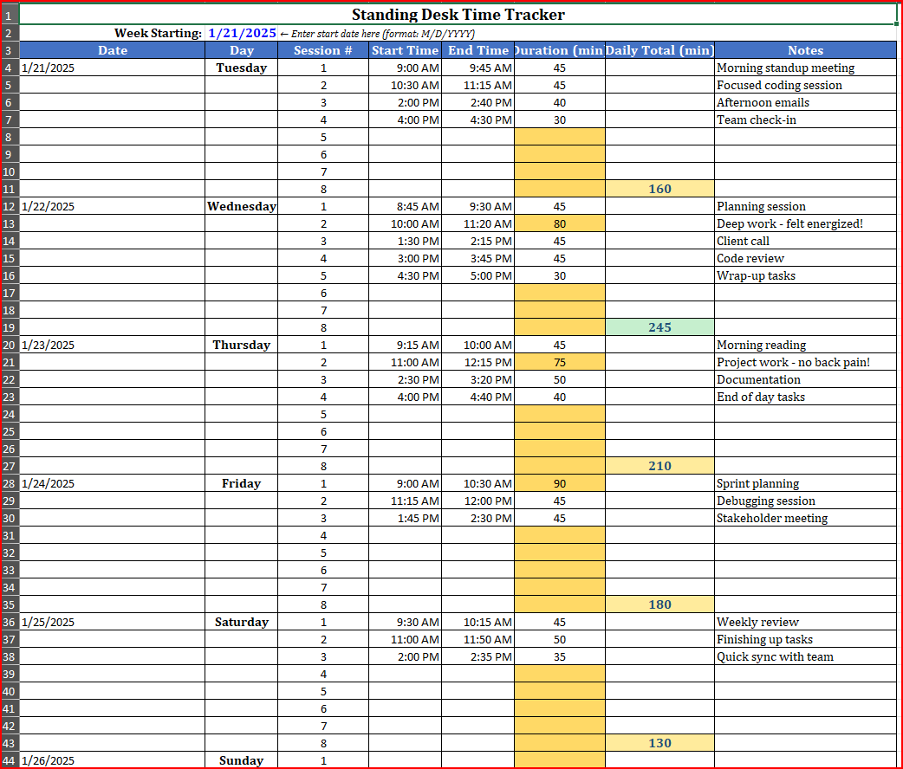
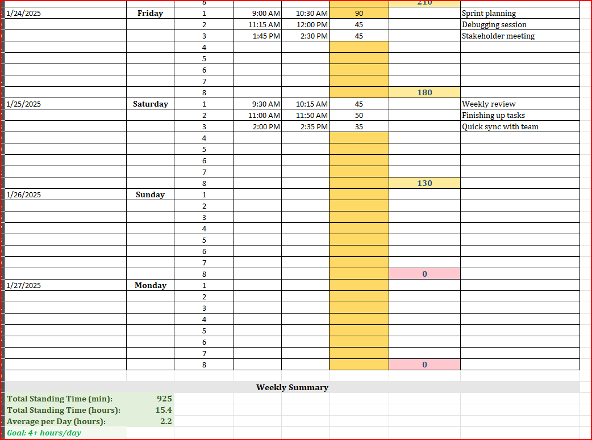
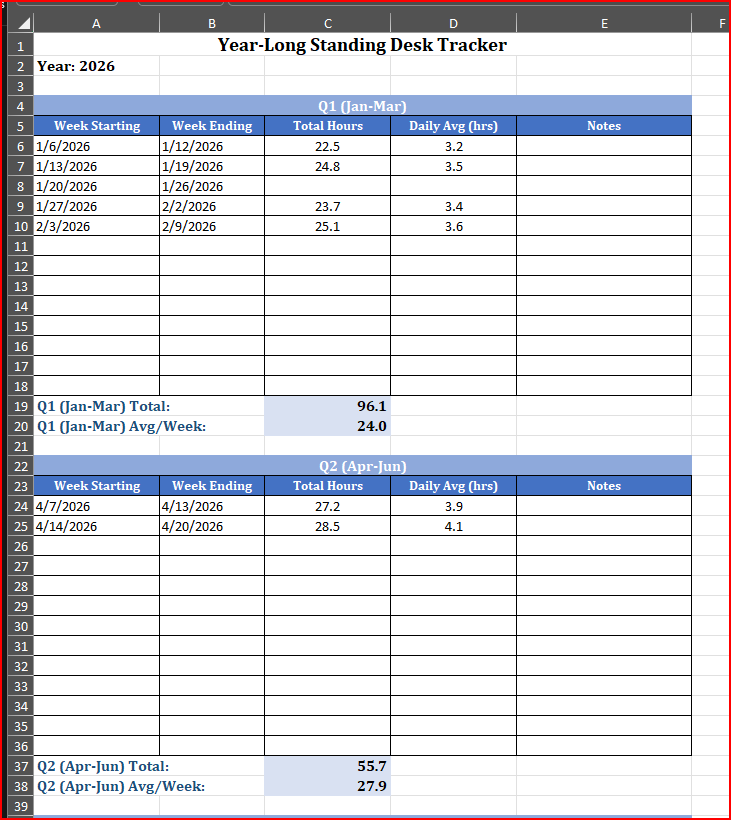
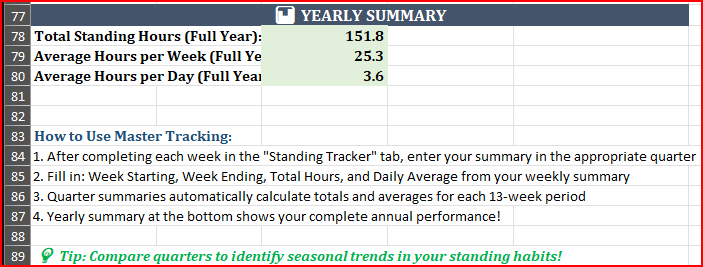

# Standing Desk Time Tracker

A comprehensive Excel-based tool to monitor and improve your standing vs. sitting habits throughout the workday. Designed to help reduce sedentary behavior, alleviate lower back pain, and promote better spinal health.


## 📋 Table of Contents
- [The Problem](#-the-problem)
- [The Solution](#-the-solution)
- [Features](#-features)
- [Screenshots](#-screenshots)
- [Installation](#-installation)
- [How to Use](#-how-to-use)
- [File Structure](#-file-structure)
- [Customization](#-customization)
- [Contributing](#-contributing)
- [License](#-license)
- [Development Notes](#-development-notes)
- [Author](#-author)

## 🎯 The Problem

Prolonged sitting is linked to:
- Lower back pain and poor posture
- Reduced circulation and energy
- Increased risk of chronic health conditions
- Decreased productivity and focus

Standing desks help, but without tracking, it's easy to:
- Forget to alternate between sitting and standing
- Stand too long without breaks (also unhealthy)
- Lose motivation without visible progress

**Existing solutions** (apps, subscriptions) often:
- Cost money for basic features
- Require constant phone/computer interaction
- Don't provide long-term historical data
- Lack customization for personal workflows

## 💡 The Solution

A free, customizable Excel tracker that:
- ✅ Logs standing time throughout your workday
- ✅ Provides visual feedback with color-coded goals
- ✅ Warns against unhealthy long standing sessions
- ✅ Tracks yearly progress with quarterly summaries
- ✅ Works offline with no subscription required
- ✅ Fully customizable to your needs

## ✨ Features

### Weekly Tracking
- **8 time slots per day** for flexible logging (Toggl-style)
- **Automatic date generation** - change one date, all 7 days update
- **12-hour time format** with AM/PM for easy reading
- **Quick time entry** with keyboard shortcuts (Ctrl+Shift+;)
- **Automatic duration calculation** in minutes
- **Word-wrapped notes** for detailed observations

### Visual Feedback
- **Color-coded daily totals:**
  - 🟢 Green: 4+ hours (240+ min) - Excellent!
  - 🟡 Yellow: 2-4 hours (120-239 min) - Good progress
  - 🔴 Red: Under 2 hours (<120 min) - Room for improvement
- **Session warnings:**
  - 🟠 Orange: Sessions over 60 minutes (take a sitting break!)

### Long-Term Tracking
- **Master Tracking sheet** with quarterly organization
- **52 weeks** of yearly tracking space
- **Quarterly summaries** (Q1, Q2, Q3, Q4)
- **Automatic yearly calculations:**
  - Total standing hours for the year
  - Average hours per week
  - Average hours per day

### User-Friendly Design
- **3 clean tabs** - no clutter
- **Comprehensive instructions** built-in
- **Formula transparency** - view and customize all calculations
- **Reusable weekly tracker** - no need for 52 separate tabs

## 📸 Screenshots

### Standing Tracker - Weekly View

*Shows the main tracking interface with time slots, automatic calculations, and color coding*

### Master Tracking - Quarterly View

*Demonstrates long-term tracking with Q1-Q4 organization and yearly summaries*

### Color-Coded Progress


*Highlights the visual feedback system for daily goals*

### Session Warning System



*Shows the orange warning for sessions exceeding 60 minutes*

## 📥 Installation

### Download Options

**Option 1: Blank Template (Recommended for use)**
1. Download `standing_tracker.xlsx`
2. Open in Microsoft Excel 2016+ or Google Sheets
3. Save a copy to your preferred location
4. Start tracking!

**Option 2: Demo Version (For preview)**
1. Download `standing_tracker_DEMO.xlsx`
2. View pre-filled sample data
3. See all features in action
4. Use for screenshots or presentations

### Requirements
- Microsoft Excel 2016 or later (Windows/Mac)
- OR Google Sheets (online)
- No macros, no external dependencies

## 🚀 How to Use

### Quick Start
1. **Set your week:** Enter the starting date in cell B2 (blue cell)
2. **Log standing time:** Enter start/end times when you stand
3. **Review progress:** Check daily totals and weekly summary
4. **Transfer to Master:** At week's end, manually copy summary to Master Tracking
5. **Repeat:** Update the week starting date and continue

### Instructions - Weekly Tracker

*Screenshot of top portion of Instructions for using WEEKLY Standing Tracker*

### Instructions - Master Tracker

*Screenshot of top portion of Instructions for using MASTER Standing Tracker*

### Time Entry Tips
- **Windows:** Press `Ctrl + Shift + ;` to insert current time
- **Mac:** Press `Cmd + ;` to insert current time
- **Manual:** Type `9:30 AM`, `2:45 PM`, etc.

### Weekly Workflow
1. Track daily standing sessions in "Standing Tracker" tab
2. At week's end, note your Weekly Summary (total hours, daily avg)
3. Go to "Master Tracking" and manually enter the week's data
4. Update "Week Starting" date for the next week
5. Repeat throughout the year!

### Best Practices
- ⏱️ Alternate sitting/standing every 30-60 minutes
- 🎯 Aim for 4+ hours of standing per day
- 🛑 Take sitting breaks if standing exceeds 60-90 minutes
- 📝 Use Notes to track how you feel, energy levels, or pain
- 📊 Review quarterly summaries to identify trends

## 📂 File Structure

```
standing-desk-tracker/
├── README.md                        # This file
├── standing_tracker.xlsx            # Blank template (for use)
├── standing_tracker_DEMO.xlsx       # Demo with sample data
├── screenshots/                     # Images for documentation
│   ├── weekly_view.png
│   ├── master_tracking.png
│   ├── color_coding.png
│   └── session_warning.png
└── LICENSE                          # MIT License
```

## 🛠️ Customization

### Viewing Formulas
- **Windows/Mac:** Press `Ctrl + ~` to toggle formula view
- **Alternative:** Formulas tab → Show Formulas button
- Click any cell and check the formula bar to see calculations

### Common Customizations
- **Adjust color thresholds:** Home → Conditional Formatting
- **Add more sessions:** Copy row structure and extend formulas
- **Change time format:** Right-click cells → Format Cells → Time
- **Create charts:** Select data → Insert → Charts
- **Modify goals:** Update the summary section thresholds

### Advanced
All formulas are transparent and editable. Common modifications:
- Change standing goal from 4 hours to your target
- Add additional tracking metrics (calories, steps, etc.)
- Create custom quarterly breakdowns
- Build visualizations with Excel charts

## 🤝 Contributing

Found a bug? Have an enhancement idea? Contributions welcome!

### Ways to Contribute
1. **Report bugs:** Open an issue describing the problem
2. **Suggest features:** Share your ideas in discussions
3. **Submit improvements:** Fork, modify, and create a pull request
4. **Share use cases:** Tell us how you're using the tracker!

### Development
Since this is an Excel file, contributions typically involve:
- Adding new features to the spreadsheet
- Improving formulas for better performance
- Enhancing conditional formatting
- Creating new documentation or tutorials

## 📄 License

This project is licensed under the MIT License - see the [LICENSE](LICENSE) file for details.

**TL;DR:** Free to use, modify, and distribute. Attribution appreciated but not required.

## 🤖 Development Notes

This project was developed with AI assistance:
- **Claude (Anthropic)** - Excel formula development, spreadsheet architecture, and documentation
- **Gemini (Google)** - Code review and feature recommendations

The core concept, problem identification, and design decisions were human-driven. AI tools were used to accelerate implementation and ensure best practices.

## 👤 Author

**Carl Lochstampfor**
- 🎓 Student at Old Dominion University (ODU)
- 💼 **LinkedIn:** [Carl Lochstampfor, Jr.](https://www.linkedin.com/in/carl-lochstampfor-jr-08b311223/)
- 🌐 **ODU ePortfolio:** [University Academic Portfolio](https://sites.wp.odu.edu/locky/)

*Built with assistance from Claude (Anthropic) for development and Gemini (Google) for review.*
---

## 🌟 Show Your Support

If this tracker helps improve your health and productivity:
- ⭐ Star this repository
- 🍴 Fork it for your own customizations
- 📢 Share it with colleagues and friends
- 💬 Leave feedback in the discussions

---

## 📊 Project Stats

- **Version:** 1.0.0
- **Last Updated:** January 2026
- **Excel Version:** 2016+
- **File Size:** ~20KB
- **Tabs:** 3 (Master Tracking, Standing Tracker, Instructions)
- **Formulas:** 91
- **No Macros:** 100% formula-based

---

## 🏷️ Topics

`excel` `health` `productivity` `time-tracking` `standing-desk` `wellness` `ergonomics` `spine-health` `fitness` `office-health` `tracker` `template` `free-tool` `open-source`

---

*Built with ❤️ to help people move more and sit less.*